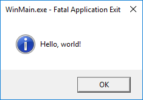

# Overview
This is a Windows version of the gibberish `int main[] = {...}` program that somehow works from [Main is usually a function. So then when is it not?](https://jroweboy.github.io/c/asm/2015/01/26/when-is-main-not-a-function.html), which in turn was spawned from the infamous [1984 winner of the International Obfuscated C Code Contest](http://www.ioccc.org/1984/mullender/mullender.c). If you haven't read the blog post before, I recommend you do so, because it is an amusing read and the rest of this readme won't make much sense to you otherwise.

The actual `main.c` file can be viewed [here](src/main.c).

# System requirements
- Windows NT 4.0 or later; Windows XP or later for 64 bits.
- Visual Studio 2003 or later (according to MSDN; I don't have any versions older than 2008 to try).

# Differences from the Linux version
You'll note that this MIUAF (Main Is Usually A Function) is much bigger than the Linux one from the blog: 300 bytes for the x86 version and 348 bytes for the x64 version, versus 49 bytes for the 64 bit Linux one. Why is this? Well, the most important difference is that in Linux land, syscall numbers are considered part of the kernel API and therefore stable. This makes it possible to do (on x86):
```asm
mov eax, 1 ; syscall number
syscall
```
and have a reasonable expectation that the `write` syscall will be invoked. On Windows on the other hand, syscall numbers are completely arbitrary and change with every release, making it so that your program that invoked `write` yesterday may format your hard drive after an OS upgrade tomorrow. There's also the fact that Windows doesn't actually *have* a `write` syscall (`kernel32!WriteConsole` does wildly different things under the hood depending on the OS version, varying from LPC communication with `csrss.exe` to `NtDeviceIoControl` calls).

The missing `write` syscall is relatively easy to work around, thanks to the [NtRaiseHardError](https://undocumented.ntinternals.net/index.html?page=UserMode%2FUndocumented%20Functions%2FError%2FNtRaiseHardError.html) native system service. This system call is responsible for showing modal error messages like 'DLL could not be found' when the app itself isn't around to do so for obvious reasons. You can also do other fun things with it like creating modal dialogs from kernel mode (in the form of `ExRaiseHardError`) and [cause BSODs from user mode](https://www.youtube.com/watch?v=3jFfTzQ6HgM). Although this is a system call, the final output (modal dialog) is presented by the user mode process `csrss.exe`.

Having found a suitable syscall target, I considered using a giant switch statement based on the syscall numbers from the [SyscallTables project](https://github.com/hfiref0x/SyscallTables), but decided against it because I wanted the application to work on future Windows versions without modifications. Simply importing `NtRaiseHardError` from ntdll.lib would be the simplest solution, but I wanted to keep the app in the spirit of the challenge from the blog post: an innocent .c file that can be handed in for an assignment to be graded by some poor TA. ntdll.lib definitely isn't part of the standard build environment; in fact, MS would prefer it if you forgot it even exists. This is not the only issue: importing from *any* library will add an import table and IAT directory to the output file. This is incompatible with an `int main[] = {...}` entry point, because the two must live in different sections with different attributes whose contents can't be controlled with one array declaration. Therefore the use of any functions, including `GetModuleHandle` and `GetProcAddress` (and their native implementations) is out of the question!

Fortunately it is *still* possible to get around this, thanks to the PEB (Process Environment Block), which contains pretty much anything about a process you could ever imagine, including many different ways to get the addresses of system DLLs such as (in this case) ntdll. After locating ntdll, all that is left is to reimplement a basic `GetProcAddress` to find the address of `NtRaiseHardError` via ntdll's export directory, and then the function can finally be called. The more or less readable original version (before obfuscation) can be seen [here](src/main-semireadable.cpp). The two NASM-syntax files (32 and 64 bit) in the `asm` directory are based on this with some adjustments to make sure only one PE section would be used.

I found that MSVC is very reluctant to place arrays of any kind in executable sections, always choosing `.data` or `.rdata` (depending on const-ness) instead, even when said array has the name of the entry point. This makes the PE invalid since the entry point is in a non-executable section. However, given enough violence (`#pragma code_seg` and `__declspec(allocate)`) it can be made to work, thus producing the final monstrosity you see here. I hope that one day it will find its way to an unsuspecting TA.